# LV.01 Vue.js 시작하기 - Age of Vue.js

##  1. vue.js 소개

### 1.1. MVVM 모델에서의 Vue
- Vue : MVVM 패턴의 뷰모델(ViewModel) 레이어에 해당하는 화면(View)단 라이브러리
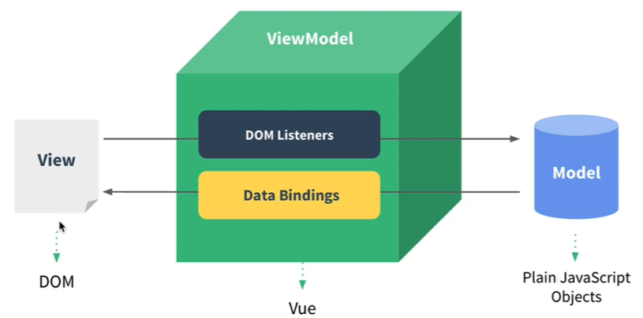
- View : (html => Dom) 사용자 화면
- Vue :
    1. Dom Listeners : 사용자 키보드 입력, 클릭 등의 정보
    2. Data Bindings : 서버에 저장된 정보를 사용자 화면에 출력

<br />

### 1.2. 기존 웹 개발 방식(HTML, Javascript)
- 기존 HTML 웹개발 방식 : HTML, CSS, Javascript
- playground/web-dev.html
    ```
    <div id="app"></div>
    <script>
        // console.log(div);
        var div = document.querySelector('#app');
        var str = 'hello word';
        div.innerHTML = str;
        
        // 일반적인 기본 개발 방식
        // 기존 코드 값 변경시 그 값을 다시 재실행
        str = 'hello word!!'
        div.innerHTML = str;
    </script>
    ```

<br />

### 1.3. Reactivity 구현
- html 문서에 아래 내용 추가
```
    <div id="app"></div>

    <script>
        var div = document.querySelector('#app');
        var viewModel = {};

        // 객체의 동작을 재정의 하는 api
        // Object.defineProperty(대상객체, 객체의 속성, {
        //    정의할 내용
        //})

        Object.defineProperty(viewModel,'str', {
            // 속성에 접근했을 때의 동작을 정의
            get: function() {
                console.log('접근');
            },
            // 속성에 값을 할당했을 때의 동작을 정의
            set: function(newValue) {
                console.log('할당', newValue);
                div.innerHTML = newValue;
            }
        })

    </script>
```
- 브라우저 console 탭에서 viewModel.str = 'hi' 입력
- 브라우저 뷰화면에서 hi 라는 문구가 보여지고 console 창엔 할당, hi 로 보여진다.
```
    <div id="app">hi</div>
```
- vue의 핵심은 데이터의 변화를 라이브러리에서 감지해서 알아서 화면을 자동으로 그려주는 것이 바로 Reactivity 라고 보면 된다.
- MVVM 모델에서의 Vue 에서 Data Bindings 을 브라우저 화면에서 보여지는 hi 라고 이해하면 된다.

<br />

### 1.4. Hello Vue.js 와 뷰 개발자 도구
- 뷰 개발자 도구 : 크롬에서 확장 프로그램 설치
    - https://chrome.google.com/webstore/detail/vuejs-devtools/nhdogjmejiglipccpnnnanhbledajbpd
    - 확장 프로그램을 설치하고 브라우저 재실행 후 개발자도구를 보면 vue 탭메뉴가 생성된다.
- vue 개발자 도구에서 컴포넌트 탭 > <Root> 클릭하면 Data 부분이 보여진다
- message 부분의 텍스트를 수정하면 브라우저에서 보여지는 부분이 바뀌는 것을 알 수 있다
- 이 기능이 Reactivity 기능이고 vue의 데이터 속성에 기본 기능이라고 이해하면 된다

<br /><br /><br />

##  2. 인스턴스

### 2.1.1 인스턴스 소개 - 뷰 인스턴스
- 인스턴스는 뷰로 개발할 때 **필수로 생성해야 하는 코드**

### 2.1.2 인스턴스 소개 - 인스턴스 생성 -1
- 인스턴스는 아래와 같이 생성할 수 있다
```
    new Vue();
```
- 인스턴스를 생성하고 나면 아래와 같이 인스턴스 안에 어떤 속성과 API가 있는 지 콘솔 창에서 확인할 수 있다
```
    var vm = new Vue();
    console.log(vm);
```
- 브라우저 console 탭에서 vm 을 입력하면 vue에 관한 인스턴스를 확인할 수 있다
```
    // 브라우저 Console 탭, clear console (ctrl + L)
    vm
```
<details><summary>Vue {_uid: 0, _isVue: true, $options: {…}, _renderProxy: Proxy, _self: Vue, …}</summary>
$attrs: (...)
$children: []
$createElement: ƒ (a, b, c, d)
$listeners: (...)
$options: {components: {…}, directives: {…}, filters: {…}, _base: ƒ}
$parent: undefined
$refs: {}
$root: Vue {_uid: 0, _isVue: true, $options: {…}, _renderProxy: Proxy, _self: Vue, …}
$scopedSlots: {}
$slots: {}
$vnode: undefined
_c: ƒ (a, b, c, d)
_data: {__ob__: Observer}
_directInactive: false
_events: {}
_hasHookEvent: false
_inactive: null
_isBeingDestroyed: false
_isDestroyed: false
_isMounted: false
_isVue: true
_renderProxy: Proxy {_uid: 0, _isVue: true, $options: {…}, _renderProxy: Proxy, _self: Vue, …}
_self: Vue {_uid: 0, _isVue: true, $options: {…}, _renderProxy: Proxy, _self: Vue, …}
_staticTrees: null
_uid: 0
_vnode: null
_watcher: null
_watchers: []
$data: (...)
$isServer: (...)
$props: (...)
$ssrContext: (...)
get $attrs: ƒ reactiveGetter()
set $attrs: ƒ reactiveSetter(newVal)
get $listeners: ƒ reactiveGetter()
set $listeners: ƒ reactiveSetter(newVal)
__proto__: Object
</details>

### 2.1.3 인스턴스 소개 - 인스턴스 생성 -2
- body 태그 안에서 app 이라고 아이디를 가진 태그를 찾아서 인스턴스를 붙이겠다는 의미.
- 붙이는 순간 vue의 기능과 속성들이 유효해진다. 
- el(엘리먼트)를 반드시 지정해줘야 사용할 수가 있다.
- 아래처럼 코드를 입력 후, 브라우저 vue 탭 > Root > data에서 입력한 정보를 확인할 수 있다
```
    <div id="app"></div>

    <script src="https://cdn.jsdelivr.net/npm/vue/dist/vue.js"></script>
    <script>
        var vm = new Vue({
            el: '#app',
            data: {
                message: 'hi'
            }
        });
    </script>
```

<br />

### 2.2.1 인스턴스와 생성자 함수 -1 javascript
- 기본적으로 자바스크립에서 어떤 함수를 이용하여 인스턴스를 생성하는 방법은 바로 생성자 함수를 이용하는 것이다.
```
    // Person 이라는 생성자 함수를 만들었다
    // 생성자 함수는 이름을 대문자로 시작한다
    function Person(name, job) {
        this.name = name;
        this.job = job;
    }

    new Person('josh', 'developer');
```
- 그러면 객체가 하나가 생성이 된다
```
    Person { name: josh, job: developer}
```
- 새로 생성된 객체를 P라는 객체 안에 넣어준다
```
    function Person(name, job) {
        this.name = name;
        this.job = job;
    }

    var p = new Person('josh', 'developer');

    console.log(p);
```
- p 객체에 대한 정보를 알 수 있다
```
    Person { name : "josh", job: "developer" }
```
- 이것이 기본 생성자 함수에 대한 정의라고 이해하면 된다

### 2.2.2 인스턴스와 생성자 함수 -2 Vue
- 생성자 함수를 이용해 logoText 라는 함수를 생성했다
```
    // function 에 Vue 라는 생성자 함수를 이용해서
    // 어떤 기능과 속성들을 사람들이 편하게 쓰게 하고 싶을 때
    // logText 함수를 미리 정의하려고 한다

    function Vue() {
        this.logText = function() {
            console.log('Hello');
        }
    }
```
- vm 으로 vue를 생성할 때 마다 객체 안에 logoText 란 함수가 들어가 있다<br />
따라서, 매번 함수를 정의하는 것이 아니라 미리 정의된 함수를 갖다가 사용할 수 있다<br />
이렇기 때문에 생성자 함수로 Vue 에서 api와 속성들을 다 정해놓고<br />
갖다 쓰거나 재사용하게 되는 패턴을 갖고 있는 것이다<br />
**이것이 new Vue()를 쓰는 이유다.**
```
    var vm = new Vue();

    vm.logoText();
```

- MDN 생성자 함수 설명 문서 :<br />
https://developer.mozilla.org/ko/docs/Web/JavaScript/Guide/Obsolete_Pages/Core_JavaScript_1.5_Guide/Creating_New_Objects/Using_a_Constructor_Function

<br />

### 2.3 인스턴스 옵션 속성
- 인스턴스에서 사용할 수 있는 속성과 API는 다음과 같다
    1. el : 인스턴스가 그려지는 화면의 시작점 (특정 HTML 태그)
    2. template: 화면에 표시할 요소(HTML, CSS 등)
    3. data: 뷰의 반응성(Reactivity)가 반영된 데이터 속성
    4. methods: 화면의 동작과 이벤트 로직을 제어하는 메서드
    5. created: 뷰의 라이프 사이클과 관련된 속성
    6. watch: data에서 정의한 속성이 변화했을 때 추가 동작을 수행할 수 있게 정의하는 속성
```
    new Vue({
        // key : value 형태
        el: ,
        template: ,
        data: , 
        methods: ,
        created: ,
        watch: ,
    });
```
- 객체를 생성하고 그 안에 표기하는 vue 문법
```
    // var vm = new Vue({객체 속성값 적용});
    
    var vm = new Vue({
        el: '#app',
        data: {
            message: 'hi',
        },
        methods: {

        },
        created: function() {

        }
    });
```

<br /><br /><br />

##  3. 컴포넌트

### 3.1 컴포넌트 소개 :: 뷰 컴포넌트
- 컴포넌트는 **화면의 영역을 구분**하여 개발할 수 있는 뷰의 기능<br />
컴포넌트 기반으로 화면을 개발하게 되면 **코드의 재사용성이 올라가고 빠르게 화면을 제작**할 수 있다<br />

<br />

### 3.2 전역 컴포넌트 등록
- 인스턴스 생성 > - el: '#app' - 객체 생성
- div id="app"에 인스턴스를 붙이겠다, 적용하겠다 
```
    <div id="app"></div>

    <script src="https://cdn.jsdelivr.net/npm/vue/dist/vue.js"></script>
    <script>
        
        new Vue({
            el: '#app'
        })
    </script>
```
- Vue 인스턴스를 생성하면 기본적으로 Root 안에 컴포넌트가 된다<br />
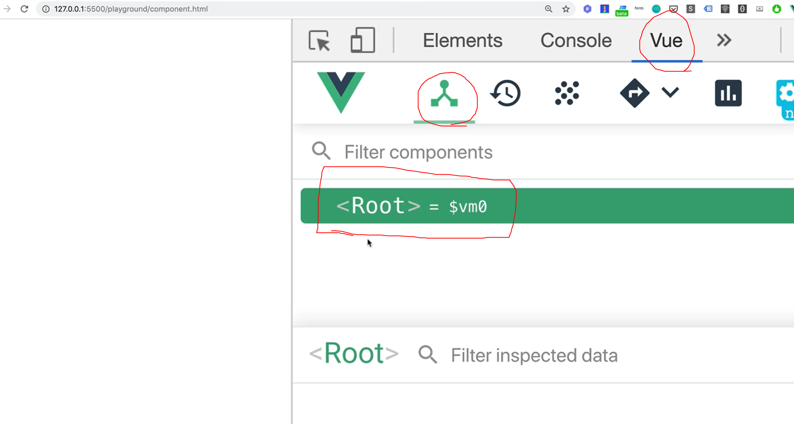<br />

- **전역 컴포넌트 등록하는 방법**
    1. component()로 전역 컴포넌트 등록
    ```
        Vue.Component('컴포넌트 이름', 컴포넌트 내용);
    ```
    2. 컴포넌트 내용엔 객체를 열어서 속성: 속성값 형식으로 적용한다
    3. 컴포넌트 내용을 적고 app-header 컴포넌트를 등록한다
    ```
        Vue.component('app-header', {
            template: '<h1>Header</h1>'
        });

        Vue.component('app-content', {
            template: '<div>content</div>'
        })

    ```
    4. 등록한 컴포넌트의 태그를 el: #app 항목 안에 적용해준다
    5. 컴포넌트한 태그를 적어주면 컴포넌트 template에 적용된 내용이 나타나게 된다
    ```
        <div id="app">
            <app-header></app-header>
            <app-content></app-content>
        </div>
    ```
    6. 전역 컴포넌트 등록은 실제 사용하는 일은 거의 없다고 한다.
    7. 브라우저, Vue 개발자 도구에서 app-header, app-content가 등록된 것을 확인할 수 있다<br />
        - Root = 상위 컴포넌트, 일반적으로 부모에 해당 된다
        - header, content 가 하위 컴포넌트로써 보통 자식 컴포넌트라고 부르기도 한다
    
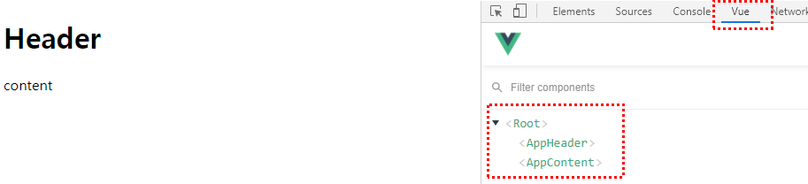

<br />

### 3.3 지역 컴포넌트 등록
- 서비스를 만들 때 가장 많이 쓰는 컴포넌트 등록 방법이다
- **지역 컴포넌트 등록하는 방법**
    1. 인스턴스 객체 안에 component 객체를 만들어준다 
        - {} 객체표기법(=객체 리터럴) ex) 속성명: {}
    ```
        new Vue({
            el: '#app',
            components: {
            }
        });
    ```
    2. component 에 생성해야 할 컴포넌트 객체를 만든다 ex) app-footer
        - 컴포넌트 내용을 적용해줄 때도 객체표기법('{}')을 이용해 작성한다
    ```
        new Vue({
            el: '#app',
            components: {
                // '키(속성)': '값(속성)',
                // '컴포넌트 이름' : 컴포넌트 내용
                'app-footer': {
                    template: '<footer>footer</footer>'
                }
            }
        });
    ```

    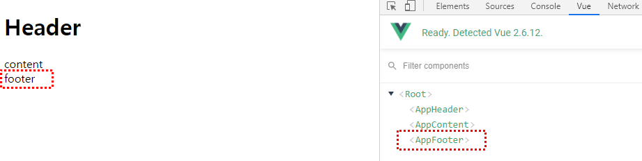

    <br />

### 3.4 전역 컴포넌트와 지역 컴포넌트의 차이점
- 전역 컴포넌트 등록 시 **component** &nbsp;&nbsp;/&nbsp;&nbsp;지역 컴포넌트 등록 시 **components**
- 지역 컴포넌트로 등록할 땐, 뒤에 **s**가 붙는 걸 명시!!!
    - 예로 method 경우에도 methods 로 적용해야 한다
```
    // 전역 컴포넌트
    Vue.component('컴포넌트 이름', 컴포넌트 내용);

    // 지역 컴포넌트
    new Vue({
        el: '#app',
        components: {
            '컴포넌트 이름': 컴포넌트 내용
        }
    });
```
- 전역 컴포넌트 사용 예<br />
: 플러그인, 라이브러리 형태로 전역으로 사용할 때만 전역 컴포넌트로 사용한다.
- 일반적으론 지역 컴포넌트를 사용하며,<br />
components 에서 어떤 컴포넌트를 사용했는 지 확인이 가능하다

### 3.5 컴포넌트와 인스턴스와의 관계
- Vue 인스턴스를 2개 만든다
```
    <div id="app"></div>
    <div id="app2"></div>

    new Vue({
        el: '#app',
    })
    new Vue({
        el: '#app2',
    })
```
- Root 가 2개 생성된 것을 확인할 수 있다
- 인스턴스를 생성하면 Root 컴포넌트로 기본 생성된다는 것을 확인할 수 있다
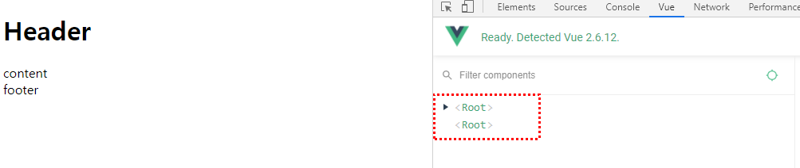

- 전역 컴포넌트(app-header) 경우, <br />
생성된 인스턴스 > components 에 적용하지 않아도되지만<br />
지역 컴포넌트(app-footer)는 반드시! 해당 인스턴스 객체 안에 표기를 해주어야 한다

- **즉, 전역 컴포넌트는 인스턴스를 생성할 때마다 적용할 필요가 없지만**<br />
**지역 컴포넌트는 반드시! 해당 인스턴스 안에 적용을 해줘야 한다!!**

```
    <div id="app">
        <app-header></app-header>
        <app-content></app-content>
        <app-footer></app-footer>
    </div>

    <div id="app2">
        <app-header></app-header>
        <app-footer></app-footer>
    </div>

    <script>

        Vue.component('app-header', {
            template: '<h1>Header</h1>'
        });

        Vue.component('app-content', {
            template: '<div>content</div>'
        })

        new Vue({
            el: '#app',
            components: {
                'app-footer': {
                    template: '<footer>footer</footer>'
                }
            }
        });

        new Vue({
            el: '#app2',
            components: {
                'app-footer': {
                    template: '<footer>footer</footer>'
                }
            }
        })

    </script>
```
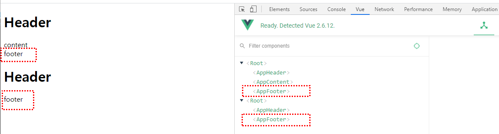

<br /><br /><br />

##  4. 컴포넌트 통신 방법 - 기본

### 4.1. 컴포넌트 통신
- 뷰 컴포넌트는 각각 고유한 데이터 유효 범위를 갖는다.
- 따라서, 컴포넌트 간에 데이터를 주고 받기 위해선 아래와 같은 규칙을 따라야 한다.

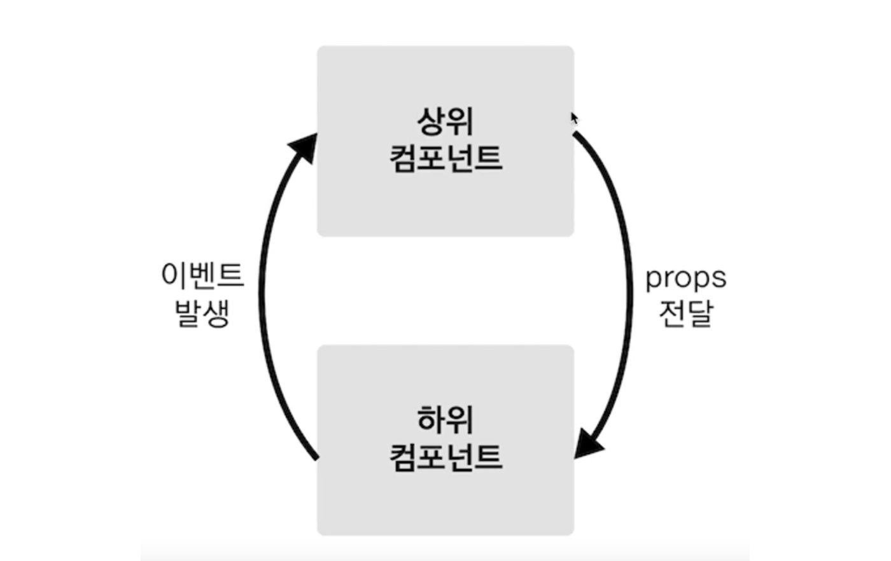

- 상위에서 하위로는 데이터를 내려줌, **프롭스 속성**
- 하위에서 사위로는 이벤트를 올려줌, **이벤트 발생**

<br />

### 4.2. 컴포넌트 통신 규칙이 필요한 이유
- 컴포넌트 통신 규칙으로 데이터의 흐름을 추적할 수 있다
- 데이터는 아래로 흘러가고 이벤트는 위로 올라가기 때문이다<br />
(데이터 = props(프롭스))
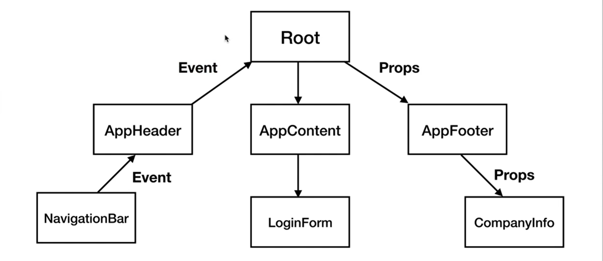

<br />

### 4.3. props 속성
- template를 변수로 만들어서 적용하려고 한다
- 아래 코드에서 components: { ***template:'< h1 >header< /h1 >'** } 이 부분을 변수로 만든다
```
    new Vue({
        el: '#app',
        components: {
            // template 길어질 수 있어 변수로 등록한다
            // 'app-header': {
                // template: '<h1>header</h1>'
            //}
            'app-header': appHeader,
        }
    });
```
- template 변수로 만들기
- 변수는 **카멜케이스를 이용**해 만든다. <br />
단어들을 묶어서 표현할 때 **첫번째 단어를 제외한 단어들의 앞글자를 대문자**로 쓴다.<br />
ex) app-header = appHeader
- template 를 변수로 만들어서 사용하는 이유는 코드가 길어지기 때문에 해당영역을 변수로 사용하여 적용한다
```
    var appHeader = {
        template: '<h1>header</h1>'
    }

    new Vue({
        el: '#app',
        components: {
            'app-header': appHeader,
        }
    });
```
- Vue() 인스턴스에 data 객체 속성을 적용하고 message 객체를 적용한다
- 뷰 개발자 도구에서 보면 Root에 data - message:hi 를 확인할 수 있다
```
    <script>
        new Vue({
            el: '#app',
            components: {
                'app-header': appHeader,
            },
            data: {
                message: 'hi'
            }
        });
    </script>
```
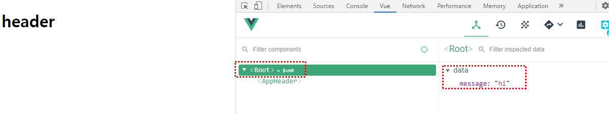

- app-header 컴포넌트에 data - message 값을 받기 위해 props 를 적용한다
```
    <app-header v-bind:프롭스 속성 이름="상위 컴포넌트의 데이터 이름"></app-header>
```
- 상위 컴포넌트의 데이터 이름 : message<br />
app-header 상위 컴포넌트는 Root = #app<br />
따라서 app의 data 에 적용된 속성이름 message 를 적어준다
- 프롭스 속성이름은 변수로 만든 appHeader 에 props 속성을 적용하여 이름을 적어준다<br />
props: ['프롭스 이름']
- 따라서 v-bind:**propsdata**=**'message'**
```
    <div id="app">
        <app-header v-bind:propsdata="message"></app-header>
    </div>

    <script src="https://cdn.jsdelivr.net/npm/vue/dist/vue.js"></script>
    <script>

        var appHeader = {
            template: '<h1>header</h1>',
            props: ['propsdata']
        }

        new Vue({
            el: '#app',
            components: {
                'app-header': appHeader,
            },
            data: {
                message: 'hi'
            }
        });
    </script>
```
- [뷰 개발자 도구] Root 에 data - message: 'hi' 값을 확인할 수 있다
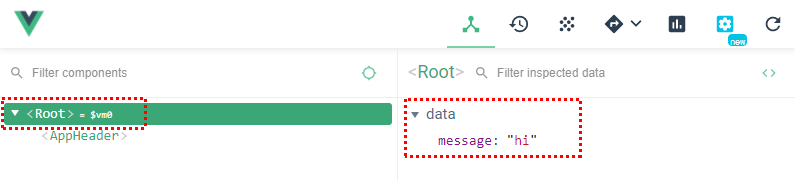

- [뷰 개발자 도구] AppHeader 에서 props - propsdata: 'hi' 값을 확인할 수 있다
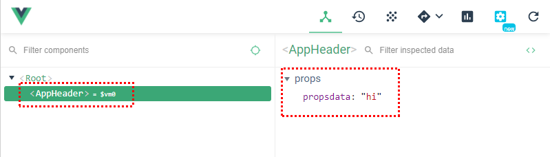

### 4.4. props 속성의 특징
- data 에서 받은 props 내용을 화면에 출력하고자 할 땐,<br />
데이터 바인딩 {{}} 문법을 통해 props에 정의한 propsdata 이름을 template 에 적용한다<br />
template: '< h1 >{{ propsdata }}< /h1 >'
- 데이터 바인딩 {{ }} 문법에 data 속성과 props 속성이름을 적어주면 해당 내용이 화면에 출력된다
```
    <div id="app">
        <app-header v-bind:propsdata="message"></app-header>
    </div>

    <script src="https://cdn.jsdelivr.net/npm/vue/dist/vue.js"></script>
    <script>

        var appHeader = {
            // template: '<h1>header</h1>',
            template: '<h1>{{ propsdata }}</h1>',
            props: ['propsdata']
        }

        new Vue({
            el: '#app',
            components: {
                'app-header': appHeader,
            },
            data: {
                message: 'hi'
            }
        });
    </script>
```
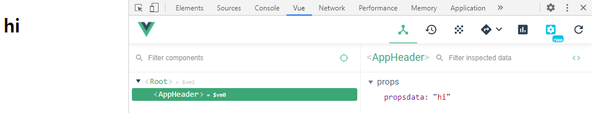

<br />

### 4.5. event emit
- **이벤트 발생 :**<br />
이벤트 발생은 컴포넌트의 통신 방법 중 하위 컴포넌트에서 상위 컴포넌트로 통신하는 방식이다
- 이벤트 발생 코드 형식<br />
하위 컴포넌트의 메서드나 라이프 사이클 훅과 같은 곳에 아래와 같이 코드를 추가한다
- this.$emit = 뷰의 api = 기능
```
    // 하위 컴포넌트의 내용
    this.$emit('이벤트 명');
```
- 그리고 나서 해당 이벤트를 수신하기 위해 상위 컴포넌트의 템플릿에 아래와 같이 구현한다.
```
    <!-- 상위 컴포넌트의 템플릿 -->
    <div id="app>
        <child-component v-on:이벤트 명="상위 컴포넌트의 실행할 메서드 명 또는 연산"></child-component>
    </div>
```
<br />

- **event emit 예시-1**
    1. button 을 만들고 v-on:click 클릭 이벤트를 적용한다
    2. 버튼을 클릭했을 때 passEvent 메서드 실행시킬려고 한다<br />
    해당 컴포넌트 변수에 methods - passEvent 함수를 정의해준다
    3. 기본적으로 메서드의 함수 표기는 아래와 같다<br />
    methods: {<br />
    &nbsp;&nbsp;//메서드 함수이름 : function()
    &nbsp;&nbsp;passEvent: function() {<br />
    &nbsp;&nbsp;}<br />
    }
    4. this.$emit('pass') => this.$emit 으로 pass 라는 이벤트를 보낼려고 한다
    ```
        <div id="app">
            <app-header></app-header>
        </div>

        <script src="https://cdn.jsdelivr.net/npm/vue/dist/vue.js"></script>
        <script>

            var appHeader = {
                template: '<button v-on:click="passEvent">click me</button>',
                methods: {
                    passEvent: function() {
                        this.$emit('pass');
                    }
                }
            }

            new Vue({
                el: '#app',
                components: {
                    'app-header': appHeader
                }
            })
        </script>
    ```
    5. [뷰 개발자 도구] Events 항목에서 이벤트 내역(로깅)을 확인할 수 있다
        - < app-header > 에서 $emit 이벤트가 발생되는데 pass라는 이벤트가 발생되었다는 것을 확인할 수 있다
    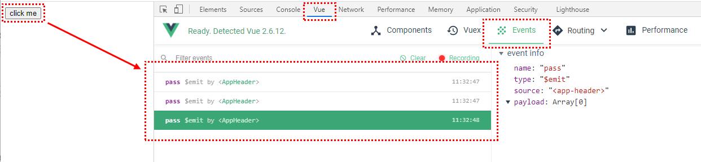

<br />

### 4.6. event emit으로 콘솔 출력하기
- $emit을 설정한 후, 컴포넌트에서 해당 값을 받을 수 있게 설정을 해줘야 한다
- v-on:하위 컴포넌트에서 발생한 이벤트 이름="상위 컴포넌트에서의 메서드 이름"
```
    <app-header v-on:하위 컴포넌트에서 발생한 이벤트 이름="상위 컴포넌트에서의 메서드 이름"></app-header>
```

<br />

- **event emit으로 콘솔 출력하는 방법**
    1. logText : 상위 컴포넌트에서의 메서드 이름<br />
    2. pass&nbsp;&nbsp;&nbsp;&nbsp;&nbsp;: 하위 컴포넌트에서 발생한 이벤트 이름<br />
    ```
        <app-header v-on:pass="logText"></app-header>
    ```
    3. Root 에서 methods - logText 함수를 생성하고<br />
    passEvent 이벤트 발생 시 해당 함수가 실행되게 적용을 한다
    ```
        new Vue({
            el: '#app',
            components: {
                'app-header': appHeader
            },
            methods: {
                logText: function() {
                    console.log('hi');
                }
            }
        })
    ```
    4. appHeader 변수에서 methods - passEvent 함수에서 정의된 this.$emit(이벤트이름)을 확인할 수 있다
    ```
        var appHeader = {
            template: '<button v-on:click="passEvent">click me</button>',
            methods: {
                passEvent: function() {
                    this.$emit('pass');
                }
            }
        }
    ```

    5. [뷰 개발자 도구] Events 에서 **click me 버튼을 클릭할 때마다 이벤트 내역(로깅) 추가 확인**을 할 수 있다<br />
    (하위 컴포넌트 --(이벤트 발생)--> 상위 컴포넌트 )
    6. [콘솔] 창에서 **click me 버튼을 클릭할 때마다 로그가 추가** 된 것을 확인할 수 있다
    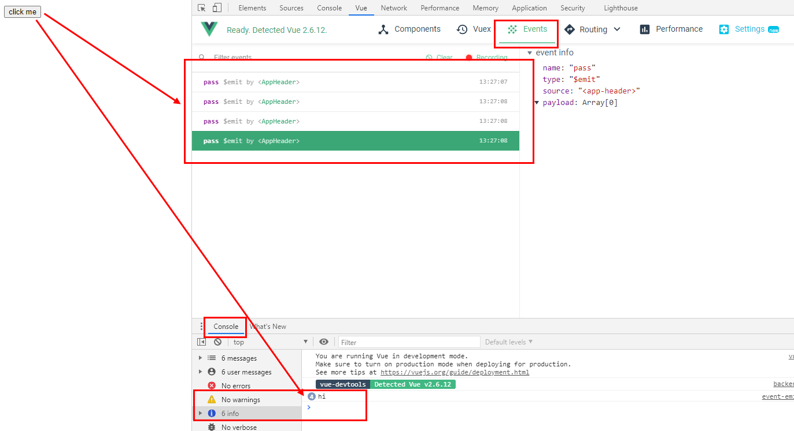

<br />

### 4.7. 실습 - event emit
- add 버튼을 클릭하면 addNumber 함수를 실행하겠다<br />
v-on:click="addNumber"
- addNumber 함수 실행 시 increase 이벤트를 실행하겠다<br />
this.$emit('increase');
```
    var appContent = {
        template: '<button v-on:click="addNumber">add</button>',
        methods: {
            addNumber: function() {
                this.$emit('increase');
            }
        }
    }
```
- increase 이벤트를 app-content 컴포넌트에서 increaseNumber 함수를 실행하겠다
- increaseNumber 함수 이벤트는 add 버튼 클릭 시 num 값을 1씩 증가 시킨다
```
    <app-content v-on:increase="increaseNumber"></app-content>

    new Vue({
        el: '#app',
        components: {
            'app-content': appContent,
        },
        methods: {
            increaseNumber: function() {
                this.num = this.num +1;
            }
        },
        data: {
            num: 10
        }
    })
```
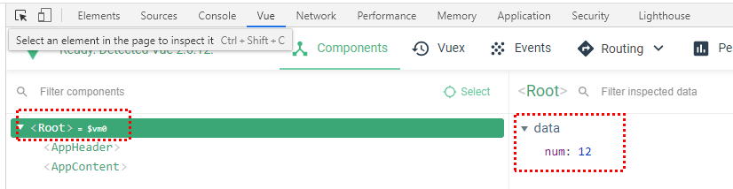

- num 값을 html에서 화면 출력하고자 할 땐, 데이터 바인딩 문법을 이용하여 적용한다
- num 값이 화면 출력 화면에 실시간으로 나오게 되고<br />
[뷰 개발자 도구] Events에서 increase 이벤트가 실행되는 것을 확인할 수 있다
```
    <div id="app">
        <p>{{ num }} </p>
    </div>
```
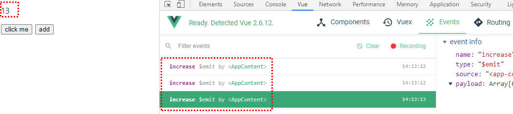

### 4.8. 뷰 인스턴스에서의 this
- obj 객체에서 num 에 접근하고 싶으면<br />
getNumber 메소드에서 this.num 으로 적용하면 된다.
- obj 객체 안에서 객체 속성에서 다른 속성이나 어떤 것을 가리킬 때에는<br />
this 를 쓰면 obj 를 가리키게 된다.<br />
(ex. obj = this )
```
    var obj = {
        num:10,
        getNumber: function() {
            console.log(this.num);
        }
    }
```
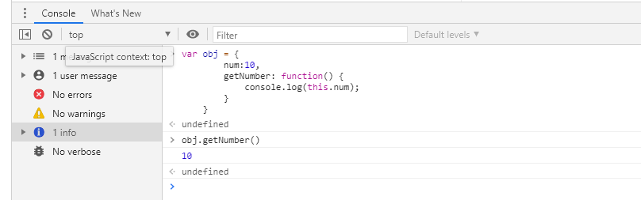

- 아래 this 가 가르키는 것은 Vue
- methods의 getNumber 속성 함수 안에서 this 는 해당 data의 num 을 바라본다
```
    var Vue = {
        el: '',
        data: {
            num: 10,
        },
        methods: {    
            getNumber: function() {
                this.num
            }
        }
    }
```

- this 관련 글 1 : https://www.w3schools.com/js/js_this.asp
- this 관련 글 2 : https://medium.com/better-programming/understanding-the-this-keyword-in-javascript-cb76d4c7c5e8

<br /><br /><br />

##  5. 컴포넌트 통신 방법 - 응용
### 5.1. 같은 컴포넌트 레벨 간의 통신 방법
- Root : Vue 인스턴스<br />
app-header 컴포넌트와 app-content 컴포넌트에서 데이터를 보내고자 할 때<br />
즉, 같은 컴포넌트 레벨 간의 톧신방법을 알아보고자 한다<br />
상위 컴포넌트 -> 하위 컴포넌트 (props 프롭스)<br />
상위 컴포넌트 <- 하위 컴포넌트 (이벤트 발생)
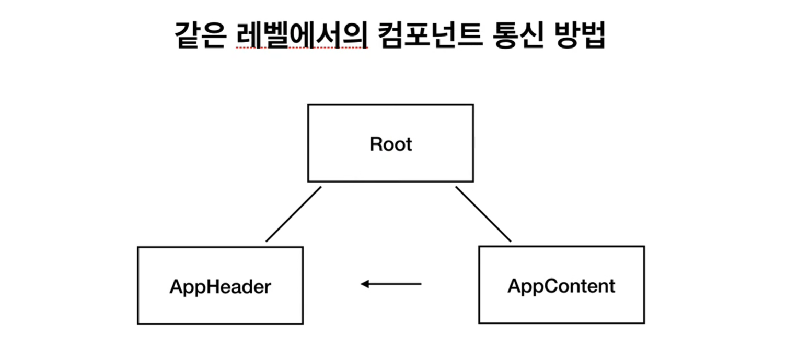

### 5.2. 같은 컴포넌트 레벨 간의 구현 1
**content 에서 pass 버튼 클릭 시 header 에 데이터를 전송하려고 한다**
```
    <div id="app">
        <app-header></app-header>
        <app-content></app-header>
    </div>

    <script>

        var appHeader = {
            template: '<div>header</div>'
        }
        var appContent = {
            template: '<div>content<button>pass</button></div>',
        }

        new Vue({
            el: '#app',
            components: {
                'app-header': appHeader,
                'app-content': appContent
            }
        });
    </script>
```
- pass 버튼 클릭 시 passNum 함수를 실행시키려고 한다<br />
- passNum 함수가 실행될 때, pass 이벤트가 실행이 되면서 10을 넘겨줄려고 한다.
```
    var appContent = {
        template: '<div>content<button v-on:click="passNum">pass</button></div>',
        methods: {
            passNum: function() {
                this.$emit('pass', 10)
            }
        }
    }
```

- pass 이벤트가 실행되면 10이 넘어간 것을 확인할 수 있다<br />
payload: Array[1] 에서 0:10 
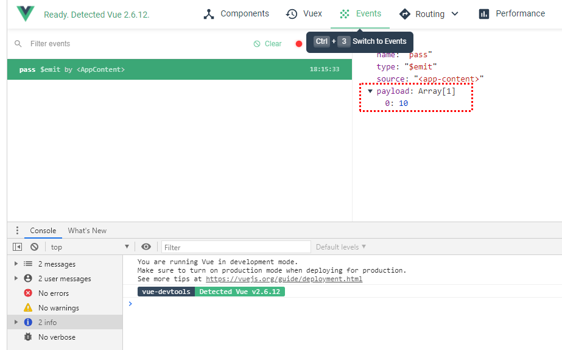<br />


- app-content 에서 app-header로 바로 데이터를 넘길 수가 없어서<br />
app-header의 상위 컴포넌트인 Root로 넘긴 후에 Root에서 app-header로 넘기려고 한다
- 올릴 때는 이벤트, 내릴 때는 props(프롭스)

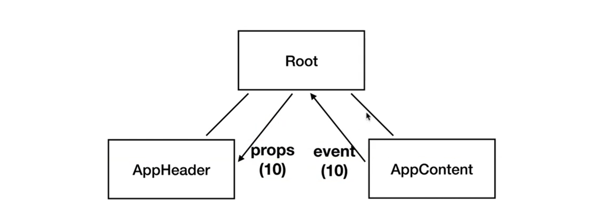<br />

- Root 에서 app-header로 데이터를 넘길려면 root에서 데이터를 선언해야 한다
```
    new Vue({
        el: '#app',
        components: {
            'app-header': appHeader,
            'app-content': appContent
        },
        data: {
            num: 0,
        }
    });
```

- app-content에서 v-on을 통해 pass 이벤트의 값을 받고 상위 컴포넌트의 메서드를 실행한다<br />
(상위 컴포넌트, 현재 기준으론 Root 를 가리키게 된다)
-  Root의 메서드 deliverNum 생성하고 pass 이벤트를 받았을 때 수행할 수 있게 v-on에 적용한다
```
    <div id="app">
        <app-header></app-header>
        <app-content v-on:pass="deliverNum"></app-header>
    </div>
```
```
    new Vue({
        el: '#app',
        components: {
            'app-header': appHeader,
            'app-content': appContent
        },
        data: {
            num: 0,
        },
        methods: {
            // 받은 인자를 value로 정의한다
            deliverNum: function(value) {
                this.num = value
            }
        }
    });
```

- pass 버튼을 클릭하면 Root에 data num:10이 생성되는 걸 볼 수 있다
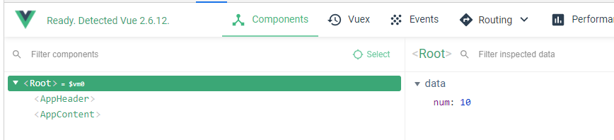<br />

- 이제, 전달된 num:10 값을 app-header에 전달하려고 한다.
- appHeader 에 props 객체를 추가해주고,<br />
app-header 태그에 v-bind로 추가한 props 객체를 연결해준다
```
    <div id="app">
        <app-header v-bind:propsdata="num"></app-header>
        <app-content v-on:pass="deliverNum"></app-header>
    </div>

    <script src="https://cdn.jsdelivr.net/npm/vue/dist/vue.js"></script>
    <script>

        var appHeader = {
            template: '<div>header</div>',
            props: ['propsdata']
        }
        var appContent = {
            template: '<div>content<button v-on:click="passNum">pass</button></div>',
            methods: {
                passNum: function() {
                    // pass 이벤트 실행, 값 10을 넘겨준다
                    this.$emit('pass', 10)
                }
            }
        }

        new Vue({
            el: '#app',
            components: {
                'app-header': appHeader,
                'app-content': appContent
            },
            data: {
                num: 0,
            },
            methods: {
                // 받은 인자(10)를 value로 정의한다
                deliverNum: function(value) {
                    this.num = value
                }
            }
        });
    </script>
```

- 작업한 html 파일에서 클릭이벤트가 제대로 작동이 되는 지<br />
[뷰 개발자 도구] Events 에서 확인해본다
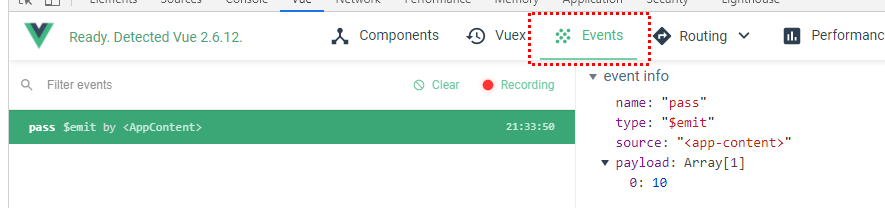<br />

- [뷰 개발자 도구] app-header 태그에 props 값이 적용된 것을 확인할 수 있다
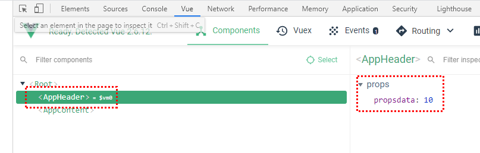<br />
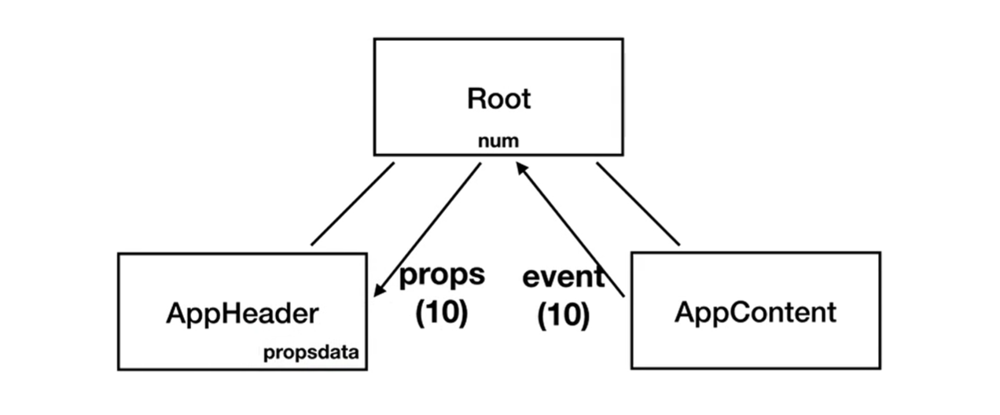

<br /><br /><br />

##  6. 라우터 (router)
### 6.1. 뷰 라우터 소개와 설치
#### 6.1.1. 뷰 라우터
뷰 라우터는 뷰 라이브러리를 이용하여 싱글 페이지 애플리케이션을 구현할 때 사용하는 라이브러리 이다<br />
공식 사이트 : https://router.vuejs.org/installation.html

#### 6.1.2. 뷰 라우터 설치
프로젝트에 뷰 라우터를 설치하는 방법은 CDN 방식과 NPM 방식 2가지가 있다

**6.1.2.1. CDN 방식**
```
    <script src="https://unpkg.com/vue-router@3.4.9/dist/vue-router.js"></script>
```
- CDN 방식으로 할 때 vue.js > vue-router 순으로 적용한다
- vue와 router 인스턴스까지 생성한다 (기본 폼)
```
    <div id="app"></div>

    <script src="https://cdn.jsdelivr.net/npm/vue/dist/vue.js"></script>
    <script src="https://unpkg.com/vue-router@3.4.9/dist/vue-router.js"></script>
    <script>

        new VueRouter({

        });

        new Vue({
            el: '#app'
        });
        
    </script>
```

**6.1.2.2. NPM 방식**
```
    npm install vue-router
```

### 6.2. 뷰 라우터 인스턴스 연결 및 초기 상태 안내
- VueRouter 를 Vue 인스턴스에 동작 시키려고 한다
- new VueRouter 를 변수 router에 담는다
- Vue 인스턴스에 변수로 만든 router 를 연결하는데<br />
router: 로 명시된 부분은 vue에 methode, components 처럼 미리 만들어져있는 속성이다<br />
router: router (변수로 만든 router를 연결한다)
```
    <script>
        var router = new VueRouter({

        });

        new Vue({
            el: '#app',
            router:  router,
        });
    </script>
```
- VueRouter 가 Vue에 제대로 주입이 되었다 라는 것을 알 수 있다
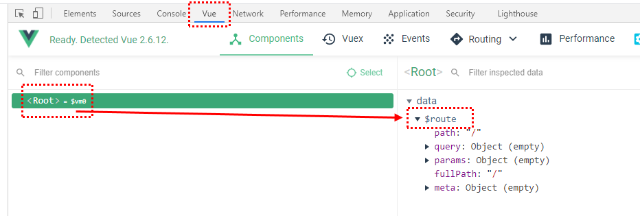

**6.2.1 뷰 라우터 등록**<br />
뷰 라우터를 설치하고 나면 아래와 같이 라우터 인스턴스를 하나 생성하고 뷰 인스턴스에 등록한다
```
    // 라우터 인스턴스 생성
    var router = new VueRouter({
        // 라우터 옵션
    })

    // 인스턴스에 라우터 인스턴스를 등록
    new Vue({
        router: router
    })
```

<br />

**6.2.2 뷰 라우터 옵션**<br />
위와 같이 라우터를 등록하고 나면 그 다음에 할 일은 라우터에 옵션을 정의하는 일이다.<br />
대부분의 SPA 앱에서는 아래와 같이 2개 옵션을 필수로 지정한다
- routes : 라우팅 할 URL과 컴포넌트 값 지정
- mode : URL의 해쉬 값 제거 속성
그럼 위 옵션으로 라우터를 정의해보겠다
```
    new VueRouter({
        mode: 'history',
        routes: [
            {
                path: '/login',
                component: LoginComponent
            },
            {
                path: '/home',
                component: HomeComponent
            }
        ]
    })
```
<br />

- mode: 'history' 는 라우팅을 할 때 URL에 # 값을 제거하고, <br />
URL 값이 /login 과 /home 일 때 각각 로그인 컴포넌트와  홈 컴포넌트를 뿌려준다<br />
(※ 아래 이미지에 네모 박스로 표시된 # 부분을 제거해준다는 뜻!)
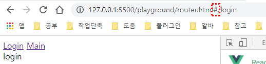
<br />

**6.2.3 router-view**<br />
브라우저의 주소 창에서 URL이 변경되면, <br />
앞에서 정의한 routes 속성에 따라 해당 컴포넌트가 화면에 뿌려진다<br />
이 때 뿌려지는 지점이 템플릿의 < router-view > 이다.
```
    <div id="app">
        <router-view></router-view> <!-- LoginComponent 또는 HomeComponent -->
    </div>
```
(6.2.1, 6.2.2) 앞에서 정의한 라우팅 옵션 기준으로 /login 은 로그인 컴포넌트를<br />
/home 은 홈 컴포넌트를 화면에 표시한다

**6.2.4 router-link**<br />
일반적으로 웹 페이지에서 페이지 이동을 할 때는 사용자가 url을 다 쳐서 이동하지 않는다.<br />
이 때 화면에서 특정 링크를 클릭해서 페이지를 이동할 수 있게 해줘야 하는데 그게 바로 < router-link > 이다.
```
    <router-link to="이동할 URL"></router-link>
```
실제 코드 예시는 다음과 같다
```
    <div>
        <router-link to="/login"></router-link>
    </div>
```
위 코드를 실행하면 화면에서는 < a > 태그로 변형되서 나온다<br />
< a > 태그를 클릭하면 /login URL로 이동이 된다

### 6.3. [실습] routes 속성 설명 및 실습안내
- VueRouter 객체 안에 routes 속성을 추가한다
- **routes** 속성은 **페이지의 라우팅 정보**를 뜻한다.
    - **페이지의 라우팅 정보란**, 어떤 URL로 이동했을 때<br />
    어떤 페이지가 뿌려질 지에 대한 정보가 배열로 담기게 된다
    - routes: [, , ...]
```
    var router = new VueRouter({
        routes: [
        ]
    });
```
<br />

- routes 속성에 2개의 페이지를 담아보려고 한다
- 2개의 페이지 모두 객체로 적용하려고 한다<br />
**즉, 페이지의 갯수만큼 객체가 들어간다** (페이지 2개를 만들 예정으로 객체 2개 생성)<br />
- 작업하기 전, 구조를 아래처럼 먼저 잡은 후 내용을 채워넣는 식으로 작업을 진행한다
```
    var router = new VueRouter({
        routes: [
            {},
            {},
        ]
    });
```

<br />

- routes 객체(**{ }**) 안에 path, component 속성을 추가한다
- path : 페이지의 url
- component : 해당 url에서 표시될 컴포넌트
```
    var LoginComponent = {
        template: '<div>login</div>'
    }

    var router = new VueRouter({
        routes: [
            {
                path: '/login',
                component: LoginComponent
            },
            {},
        ]
    });
```

<br />

- **< router-view >**<br />
: 페이지 url이 이동(변경)되었을 때 그 url에 따라서 변경되는 영역을 말한다
- router-view는 Vue 인스턴스에 router 속성으로 연결이 되어야만 쓸 수 있는 태그이다.<br />
(연결이 안되었을 경우, 콘솔 창에 에러 발생)
```
    <div id="app">
        <router-view></router-view>
    </div>
```
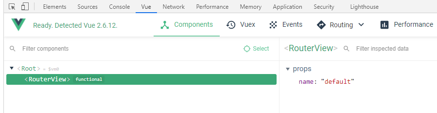

<br />

- 주소 뒤에 /login 으로 페이지 이동을 하게 되면<br />
해당 페이지에 맞는 컴포넌트로 변경된 것을 확인할 수 있다
- **path 속성에 기입한 url로 페이지 이동되면 해당 컴포넌트로 변경**
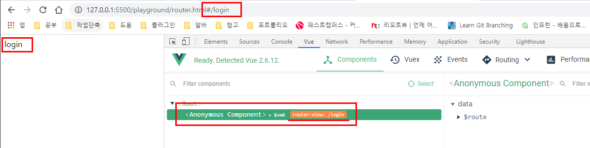

<br />

### 6.4. 링크를 이용한 페이지 이동 및 router-link 태그 설명
- router-link 태그는 페이지 이동을 위한 링크 태그이다
- **router-link to="경로"** 를 적어주면 된다
```
    <div id="app">
        <!-- router-link 태그는 페이지 이동을 위한 링크 태그이다 -->
        <div>
            <router-link to="/login">Login</router-link>
            <router-link to="/main">Main</router-link>
        </div>

        <!-- 페이지 url이 이동(변경)되었을 때 그 url에 따라서 변경되는 영역  -->
        <router-view></router-view>
    </div>
```
- router-link 태그는 html 페이지에서는 **< a href="/login" > Login < /a >** 로 보여지게 된다
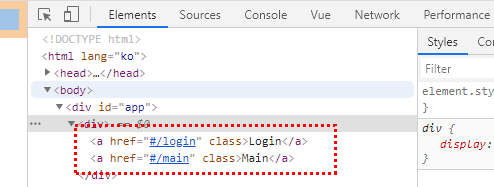

<br /><br /><br />

##  7. HTTP 통신 라이브러리 - axios(액시오스)
### 7.1. HTTP 라이브러리와 Ajax 그리고 Vue Resource
**HTTP 라이브러리와 Ajax**<br />
- Ajax(Asynchronous Javascript and XML, 에이잭스)는 비동기적 웹 애플리케이션의 제작
- 특정 데이터만 서버에 요청하여 받아올 수 있다
- 뷰 라우터 라던지 싱글 페이지 웹 애플리케이션이 구현하기 쉬워졌다
- ex. jQuery.ajax()

<br />

**Vue Resource**<br />
- pagekit/vue-resource : <br />
2,3년전 공식 라이브러리 였지만 vue 창지자 에반뉴가 공식 라이브러리로 관리하지 않겠다고 발표했다
- 현재는 공식 라이브러리로 지정되지 않은 상태로 추후 작업할 때 참고해야 한다
- 샘플들을 볼 때 구 버전일 확률로 주의해서 사용해야 한다

<br />

### 7.2. axios  소개 및 오픈소스를 사용하기 전에 알아야 할 것들
**7.2.1 axios(액시오스)**
뷰에서 권고하는 HTTP 통신 라이브러리는 액시오스(Axios).<br />
**Promise 기반의 HTTP 통신 라이브러리**이며 상대적으로 다른 HTTP 통신 라이브러리들에 비해<br />
**문서화가 잘되어 있고 API가 다양**하다
- https://github.com/axios/axios<br />
또는 구글에서 axios github 검색

- 오픈소스(github)을 이용할 때 참고할 점
    - Star : 페이스북의 좋아요와 같은 기능 (인지도를 확인할 수 있다)
    - commits :작업 이력 확인
    - contributors : 수정/보완을 하기 위해 몇 명의 사람들이 동참했는 지 확인 가능
    - 최신 수정 날짜도 확인을 한다

    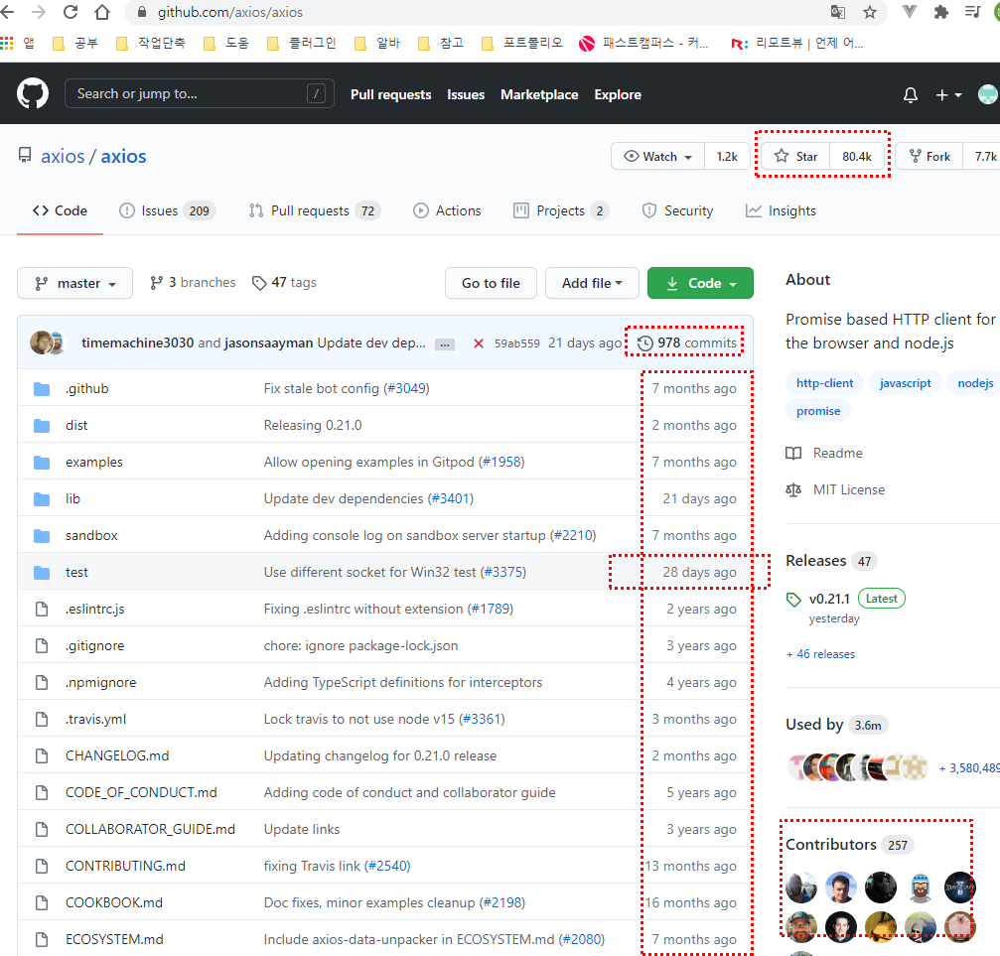

- **비동기 처리 :** <br />
자바스크립트의 비동기 처리란 특정 코드의 연산이 끝날 때까지 코드의 실행을 멈추지 않고<br />
다음 코드를 먼저 실행하는 자바스크립트의 특성을 의미한다

<br />

- **자바스크립트의 비동기 처리 패턴**
    1. callback
    2. promise
    3. promise + generator
    4. async & await

<br />

- **promise :** javascript 의 비동기적 처리 방법
    - "A promise is an object that may produce a single value some time in the future"
    - 프로미스 : 자바스크립트 비동기 처리에 사용되는 객체<br />
    - 프로미스 : 주로 서버에서 받아온 데이터를 화면에 표시할 때 사용한다<br />
    - **프로미스의 3가지 상태(states)**
        - Pending(대기) : 비동기 처리 로직이 아직 완료되지 않은 상태
        - Fulfilled(이행) : 비동기 처리가 완료되어 프로미스가 결과 값을 반환해준 상태 (=완료)
        - Rejected(실패) : 비동기 처리가 실패하거나 오류가 발생한 상태

<br />

- **여러 개의 프로미스 연결하기 (Promise Chaining) :**<br />
프로미스의 또 다른 특징은 여러 개의 프로미스를 연결하여 사용할 수 있다<br />
then() 메서드를 호출하고 나면 새로운 프로미스 객체가 반환된다
```
    function getData() {
        return new Promise({
            // ...
        });
    }

    // then() 으로 여러 개의 프로미스를 연결한 형식
    getData()
        .then(function(data) {
            // ...
        })
        .then(function() {
            // ...
        })
        .then(function() {
            // ...
        });
```
<br />

- **실무에서 있을 법한 프로미스 연결 사례**
    - 실제 웹 서비스에서 있을 법한 사용자 로그인 인증 로직에 프로미스를 여러 개 연결해보았다
    ```
        getData(userInfo)
            .then(parseValue)
            .then(auth)
            .then(diaplay);
    ```
    - 위 코드는 페이지에 입력된 사용자 정보를 받아와 파싱, 인증 등의 작업을 거치는 코드를 나타낸다<br />>
    여기서 userInfo는 사용자 정보가 담긴 객체를 의미하고, parseValue, auth, display는 각각 프로미스를 반환해주는 함수라고 가정한다
    ```
        var userInfo = {
            id: 'test@abc.com',
            pw: '****'
        };

        function parseValue() {
            return new Promise({
                // ...
            });
        }
        function auth() {
            return new Promise({
                // ...
            });
        }
        function display() {
            return new Promise({
                // ...
            });
        }
    ```
    - **여러 개의 프로미스를 .then()으로 연결하여 처리**할 수 있다

<br />

- **프로미스의 에러 처리 방법**
    - 실제 서비스를 구현하다 보면 네트워크 연결, 서버 문제 등으로 인해 오류가 발생할 수 있다<br />
    따라서, 프로미스의 에러 처리 방법에 대해서도 알고 있어야 한다
    - 에러 처리 방법에는 다음과 같이 2가지 방법이 있다
        1. then()의 두 번째 인자로 에러를 처리하는 방법
        ```
        getData().then(
            handleSuccess,
            handleError
        );
        ```
        2. catch()를 이용하는 방법
        ```
            getData().then().catch();
        ```
        3. 위 2가지 방법 모두 프로미스의 reject() 메서드가 호출되어 실패 상태가 된 경우에 실행된다<br />
        간단하게 말해서 프로미스의 로직이 정상적으로 돌아가지 않는 경우 호출된다
        ```
            function getData() {
                return new Promise(function(resolve, reject) {
                    reject('failed');
                });
            }

            // 1. then()의 두 번째 인자로 에러를 처리하는 코드
            getData().then(function() {
                // ...
            }, function(err) {
                console.log(err);
            });

            // 2. catch()로 에러를 처리하는 코드
            getData().then().catch(function(err) {
                console.log(err);
            });
        ```
<br />        

- **프로미스 에러 처리는 가급적 catch()를 사용**
    - 개인의 코딩 스타일에 따라서 then()의 두 번째 인자로 처리할 수도 있고 catch()로 처리할 수도 있겠지만<br />
    **가급적 catch()로 에러를 처리하는 게 더 효율적**이다<br />

    1. catch() 코드를 써야 하는 이유 - 아래 코드 참고
    ```
        // then()의 두 번째 인자로는 감지하지 못하는 오류
        function getData() {
            return new Promise(function(resolve, reject) {
                resolve('hi');
            });
        }

        getData().then(function(result) {
            console.log(result);
            throw new Error("Error in then()"); // Uncaught (in promise) Error: Error in then()
        }, function(err) {
            console.log('then error : ', err);
        });
    ```

    2. getData() 함수의 프로미스에서 resolve() 메서드를 호출하여 정상적으로 로직을 처리했지만,<br /> 
    then()의 첫 번째 콜백 함수 내부에서 오류가 나는 경우 오류를 제대로 잡아내지 못 한다<br />
    따라서 코드를 실행하면 아래와 같은 오류가 난다

    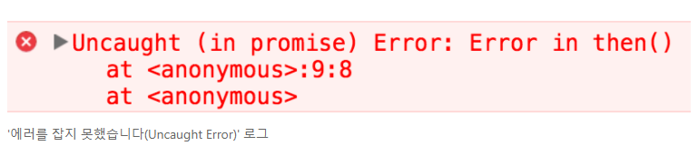

    3. 하지만 똑같은 오류를 catch()로 처리하면 다른 결과가 나온다
    ```
        // catch()로 오류를 감지하는 코드
        function getData() {
            return new Promise(function(resolve, reject) {
                resolve('hi');
            });
        }

        getData().then(function(result) {
            console.log(result); // hi
            throw new Error("Error in then()");
        }).catch(function(err) {
            console.log('then error : ', err); // then error :  Error: Error in then()
        });
    ```
    4. 위 코드의 처리 결과는 다음과 같다
    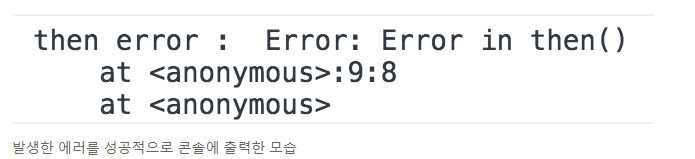

    5. **따라서, 더 많은 예외 처리 상황을 위해 프로미스의 끝에 가급적 catch()를 사용해야 한다**

<br />

- **async & await**
    - async와 await는 자바스크립트의 비동기 처리 패턴 중 가장 최근에 나온 문법이다<br />
    기존의 비동기 처리 방식인 콜백 함수와 프로미스의 단점을 보완하고 개발자가 읽기 좋은 코드를 작성할 수 있게 도와준다

<br />

### 7.3. axios 실습 및 this 설명
- get user 버튼 클릭 시 **getData 메서드 실행**
- 샘플 데이터 정보(10개의 사용자 정보가 담긴 객체 배열) : https://jsonplaceholder.typicode.com/users/
    - jsonplaceholder : 자바스크립트로 api를 요청할 때 테스트해볼 수 있는 사이트
- 샘플 데이터를 받아올 때 **성공하면 then 진입** / **실패하면 catch 를 진입**
- **then, catch 개념은 promise 에서 이해**해야 한다
```
    <div id="app">
        <button v-on:click="getData">get user</button>
    </div>

  <script src="https://cdn.jsdelivr.net/npm/vue/dist/vue.js"></script>
  <script src="https://unpkg.com/axios/dist/axios.min.js"></script>
  <script>
    new Vue({
        el: '#app',
        methods: {
            getData: function() { 
            axios.get('https://jsonplaceholder.typicode.com/users/')
                .then(function(response) {
                    console.log(response);
                })
                .catch(function(error) {
                    console.log(error);
                });
            }
        }
    })
  </script>
```
- 서버에서 받아온 데이터 결과물 <br />
    - 액시오스에서의 일반적인 구조 
        1. config 속성
        2. data 속성 : data 영역을 보면 사용자 정보 10개가 보여진다
        3. headers 속성
        4. request 속성
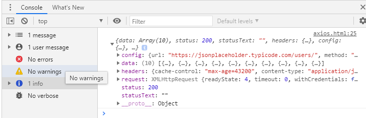

<br />

- data 정보만 보고싶을 경우 console.log(response.data); 로 확인할 수 있다
```
    new Vue({
        el: '#app',
        methods: {
            getData: function() { 
            axios.get('https://jsonplaceholder.typicode.com/users/')
                .then(function(response) {
                    console.log(response.data);
                })
                .catch(function(error) {
                    console.log(error);
                });
            }
        }
    })
```
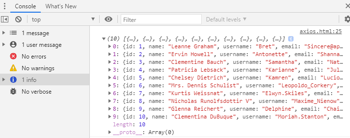

<br />

- response.data 정보를 화면에 출력하고자 한다
    1. Vue 인스턴스에 data 속성 객체를 추가하고 users 빈 배열 객체를 추가한다
    ```
        new Vue({
            el: '#app',
            data: {
                users: []
            },
        })
    ```
    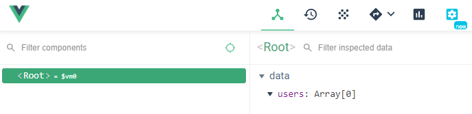
    
    <br />

    2. this 를 사용하여 data - users에 정보를 전달 해야 하는데<br />
    해당 위치의 this가 무엇을 가리키는 지는 console.log(this)로 확인을 해본다
        - A this 와 B this 는 가리키는 것이 다르다. <br />
        A this 는 Vue 인스턴스 를 가리키지만 B this 는 수시로 바뀌게 된다<br />
        따라서 B this 가 가리키는 것이 A this 와 동일하게 하고자 한다면 <br />
        A this 를 변수로 선언해줘야 한다
    ```
        new Vue({
            el: '#app',
            data: {
                users: []
            },
            methods: {
                getData: function() { 
                    console.log('A'+this);
                    axios.get('https://jsonplaceholder.typicode.com/users/')
                        .then(function(response) {
                            console.log('B'+this);
                        })
                        .catch(function(error) {
                            console.log(error);
                        });
                }
            }
        })
    ```

    3. A this 를 변수 vm 으로 선언한다
    ```
        new Vue({
            el: '#app',
            data: {
                users: []
            },
            methods: {
                getData: function() { 
                    var vm = this;
                    axios.get('https://jsonplaceholder.typicode.com/users/')
                        .then(function(response) {
                            console.log(response.data);
                            vm.users = response.data;
                        })
                        .catch(function(error) {
                            console.log(error);
                        });
                }
            }
        })
    ```

    4. [뷰 개발자 도구] get user 버튼을 클릭하면<br />
    Root - data > users 속성에 사용자 정보가 추가된 것을 확인할 수 있다
    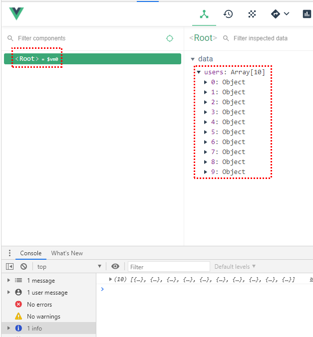


    5. Root 에서 받아온 users 정보를 화면에 출력하고자 할 땐<br />
    div 안에 {{ users }} 를 적용해준다
    ```
        <div id="app">
            <button v-on:click="getData">get user</button>
            <div>
                {{ users }}
            </div>
        </div>

        <script src="https://cdn.jsdelivr.net/npm/vue/dist/vue.js"></script>
        <script src="https://unpkg.com/axios/dist/axios.min.js"></script>
        <script>
            new Vue({
                el: '#app',
                data: {
                    users: []
                },
                methods: {
                    getData: function() { 
                        var vm = this;
                        axios.get('https://jsonplaceholder.typicode.com/users/')
                            .then(function(response) {
                                console.log(response.data);
                                vm.users = response.data;
                            })
                            .catch(function(error) {
                                console.log(error);
                            });
                    }
                }
            })
        </script>
    ```
    
    6. get user 버튼을 클릭하면 [] -> [사용자정보] 를 확인할 수 있다
    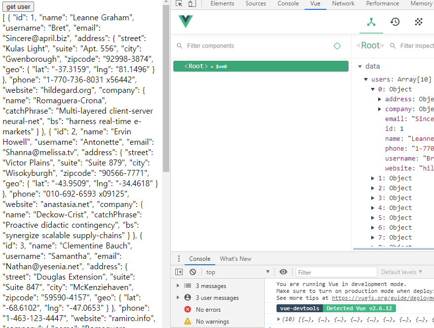

    